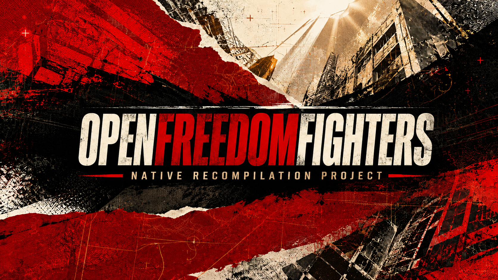

# OpenFreedomFighters

[](https://github.com/yeager/openfreedomfighters/actions/workflows/build.yml)



A clean-room native reimplementation of *Freedom Fighters*, targeting Windows,
macOS, Linux and Steam Deck.

**Not playable yet.** The build opens a window and loads startup data, but
normal startup does not yet run the original intro, menus, or gameplay.

You need your own copy of the game. Buy *Freedom Fighters* from the
[official Steam store page](https://store.steampowered.com/app/1347780/Freedom_Fighters/).
The Steam purchase includes the game and the *Freedom Fighters Soundtrack*.
The supported data set is the Steam Windows release; other editions have not
been validated. No original game files, executable code, soundtrack files, or
other retail assets are included here.

By default, OpenFreedomFighters looks for the owned data in
`~/.openfreedomfighters` (or `%USERPROFILE%\\.openfreedomfighters` on Windows).
Pass `--data PATH` to use another location, or set `OPENFREEDOMFIGHTERS_DATA`
for a portable installation.

## Current state

- The Steam executable has been disassembled for private research.
- Archive, texture, geometry and supported audio formats have working readers.
- Startup shows the project splash for three seconds. Missing or invalid game
  data produces an error dialog over it.
- Game files are fully checked against a SHA-256 manifest at every startup.
  A local, disposable deep-audit certificate avoids repeating the much slower
  archive parse after a successful hash pass; it never replaces hashing.
  The Steam soundtrack's optional MP3 and FLAC files are detected separately:
  they can be decoded safely when installed, but cue mapping and music playback
  are not implemented yet. Their absence never blocks startup.
- The first intro sequence's camera, pictures and textures load from game data.
  One retained runtime owns their hierarchy and mutable picture state; intro
  textures upload to the GPU. Indexed drawing works in explicit integration
  tests; normal startup activation is not connected yet.
  [Camera membership and listener selection](docs/CAMERA_REGISTRATION.md) now
  share the scene's runtime identities, including across scene reloads.
  [Preview-camera controls](docs/PREVIEW_CAMERA.md) handle keyboard and pointer
  updates in tests; their normal input and component dispatch are not connected.
- A normal two-frame smoke run on the supported owned installation reaches the
  native SDL/Vulkan backend, validates all data, uploads six startup images and
  26 intro images, and then exits. Normal startup does not draw the original
  intro yet.
- `--diagnostic-intro-picture` can render one source-backed first-cut picture
  with its decoded images and quad geometry. It uses an explicitly project-owned
  fit projection and baseline GPU state, so it is a visual diagnostic—not
  cutscene playback or a recovered camera path.
- Clock and sound preferences now share application-lifetime state across intro
  scenes. This does not add intro playback or audible sound.
- The two intro sound definitions resolve to their original audio-bank streams
  and can be decoded incrementally on a worker. A
  [channel service](docs/STEREO_STREAM_PLAYBACK.md) now handles bounded refill,
  start/stop and pending notifications. Its SDL stereo-output adapter accepts
  the complete reviewed 100--100,000 Hz control range without pitch clamping;
  an unbound SDL test verifies its duration and pitch composition. Normal
  startup does not use it yet; continuous output on a physical device remains
  unverified.
- Their mutable sound records now share an application-owned backend with volume
  settings. Typed attachment loading, owner preparation, stop and the verified
  SoundExtend parameter operation are implemented. The complete
  [startup audio lifecycle](docs/INTRO_AUDIO_STARTUP_ORDER.md) is not connected.
- Normal startup constructs ROOT, RootGroup, and all 470 authored intro owners
  from the supported scene directory. It allocates all 470 authored resources,
  retains 383 constructed attachment instances, queues 420 deferred readers,
  and preserves the authored hierarchy, event names, saved flags, and supported
  sound-owner state. Normal startup runs the ordinary deferred-reader bracket
  and admits twelve reviewed, source-backed reader records. The other 408
  records remain intentionally unconsumed. A scene-owned session now
  retains this runtime and owns the exactly-once reader bracket instead of
  leaving its callback wiring in `main`. The checked loader-tail transition is
  implemented, but its concrete source services and normal-startup call remain
  missing. Global lifecycle admission, renderer associations, scene updates,
  rendering, audio playback, menus, and gameplay remain unimplemented.
  Window console/property bindings and the scene event-name table are live.
  None of the cameras is registered for normal rendering yet.
  DefaultCam and its PreviewCamera now share an [ordinary update queue](docs/ORDINARY_COMPONENTS.md)
  with real admission and sorting. This path still requires the preceding loader
  state and is not called by normal startup yet.
- The remaining bridge is specified as a [normal startup scene host](docs/NORMAL_STARTUP_SCENE_HOST.md):
  it must admit lifecycle, the first cut, camera/view, drawing and audio in one
  ordinary-frame order. Its reader-stage session is connected; later lifecycle
  and rendering stages are not implemented yet.
- F10 opens a working graphics-settings panel. It uses a project-authored,
  letterboxed menu composition and restrained text focus, informed by private
  observation without copying retail UI pixels or wording. Text follows the
  system locale and uses in-memory retail UI fonts when coverage is available,
  including mixed-script LTR runs aligned to one baseline.
- A separate geometry preview is available with `--diagnostic-scene`. It is not
  a loaded level or a gameplay demo.
- Project-authored deterministic simulation replays have a versioned `OFRP`
  envelope with strict limits and a SHA-256 corruption check. They are tooling
  data, not compatible with retail saves or recordings.

The picture renderer has passed GPU tests on Linux/Vulkan, Windows/Direct3D 12
and macOS/Metal. CI uses independent fixtures, not retail assets; these tests
do not establish complete intro playback.

Next: connect the scene's component lifecycle and update loop so normal startup
renders the original intro and reaches its main menu. This takes priority over
graphics polish and more isolated helpers. Details
are in the [intro notes](docs/INTRO_BOOTSTRAP.md) and [roadmap](docs/ROADMAP.md).

## Planned modes

These are targets, not working renderers:

- **Original:** the original gameplay and presentation.
- **Modern:** higher resolutions, improved lighting, shadows and filtering.
- **Modern+:** optional HD assets and future DLSS 4.5 / Intel XeSS-SR backends on supported hardware.

The settings panel has a mode selector. It records DLSS and XeSS requests but
uses portable temporal or native rendering until a verified native adapter is
available. HD asset support is not implemented. See [Modern graphics](docs/MODERN_GRAPHICS.md),
[DLSS](docs/DLSS.md), and [XeSS](docs/XESS.md) for scope and licensing.
Project-authored UI strings already select the system locale across 20 locales,
including Swedish. Complete game-text localization, shaping and full retail-font
coverage remain planned.

## Build and run

### Required

Build from source needs a C++23 compiler, CMake 3.25 or newer, and development
files for zlib, libogg, libvorbis, and FreeType. `libvorbisenc` is required too:
the test suite uses it to create independent Ogg/Vorbis fixtures. Ninja is the
recommended generator, but any CMake generator can be used. Git is only needed
to obtain the source tree; it is not consulted by CMake.

| Platform | Toolchain and direct dependencies |
|---|---|
| Ubuntu/Debian | `build-essential cmake ninja-build pkg-config zlib1g-dev libvorbis-dev libfreetype-dev` |
| macOS | Xcode Command Line Tools, then `brew install cmake ninja zlib libvorbis freetype` |
| Windows | Visual Studio 2022 with **Desktop development with C++**, a current Windows SDK, CMake, and either Ninja or the Visual Studio generator. Provide zlib, FreeType, libogg, and libvorbis (including `vorbisfile` and `vorbisenc`) through `CMAKE_PREFIX_PATH`. The pinned source-build recipe used by CI is [`.github/actions/windows-dependencies/action.yml`](.github/actions/windows-dependencies/action.yml). |

SDL3 is the only graphics/window/input dependency. CMake uses an installed SDL
3.2+ package when available; otherwise it downloads checksum-pinned SDL 3.4.10
and SDL_ttf 3.2.2 source archives while configuring. That fallback requires
network access and the platform headers SDL itself enables. On Ubuntu/Debian,
the complete fallback package set used in CI is recorded in
[`.github/workflows/build.yml`](.github/workflows/build.yml); installing a
compatible system SDL3 package is usually simpler for local builds. SDL_ttf is
always built from the pinned archive and uses the required system FreeType.

MP3 and FLAC soundtrack support uses the vendored `dr_mp3` and `dr_flac`
headers, so no MP3 or FLAC development package is needed. Shader compiler tools,
Capstone, and Python analysis dependencies are optional developer tooling;
normal builds use the checked-in generated shaders. See
[THIRD_PARTY.md](THIRD_PARTY.md) for versions, licenses, and the exact optional
tooling roles.

```sh
cmake -S . -B build -G Ninja -DCMAKE_BUILD_TYPE=Debug
cmake --build build
ctest --test-dir build --output-on-failure

# Optional: verify LOC candidate discovery against your owned installation.
OFF_LOC_DATA_ROOT=/path/to/FreedomFighters ./build/off_loc_string_index_tests

# Check your installation without opening a window.
./build/openfreedomfighters --verify-only

# Inspect the checked, non-playing first-cut reader boundary. This opens no
# window and never starts audio, schedules an event, or renders a cutscene.
./build/openfreedomfighters --probe-first-cut-cold

# Exercise both recovered first-cut initialization phases against retained
# owned-data identities. This is still cold: no clock, scene host, audio, or
# renderer is admitted.
./build/openfreedomfighters --probe-first-cut-initialization

# Validate the retained intro renderer payload through its source-reference
# relocation and workspace grammar. This creates no renderer container or frame.
./build/openfreedomfighters --probe-intro-renderer-payload

# Profile the retained named/global tagged block without printing its label or
# payload. This does not relocate references or run its typed reader.
./build/openfreedomfighters --probe-intro-named-global

# Start the current native prototype.
./build/openfreedomfighters --mode original
```

Use the executable path produced by your build configuration; Windows builds
use `openfreedomfighters.exe`. Replace `original` with `modern` to select the
other profile. Pass `--data /path/to/FreedomFighters` when the owned install is
not in the default location.

F10 toggles settings. Close the window to exit. For development:

- `--frame-limit N` exits after a bounded number of rendered frames.
- `--show-graphics-menu` opens settings immediately.
- `--diagnostic-scene` opens the geometry preview instead of normal startup.
- `--diagnostic-scene relative/archive.ZIP` inspects one owned scene archive
  below `Scenes/` through the source-only diagnostic renderer. It is not
  gameplay, original camera behavior, or a faithful level renderer.
- `--diagnostic-startup-graphics` draws the retained startup archive's six
  decoded images and 77 source-backed quads through the same source-only GPU
  diagnostic path. Its fit projection is a comparison aid, not recovered menu
  camera, material, or layout behavior.
- `--diagnostic-intro-picture` draws the retained first-cut picture through the
  indexed SDL GPU renderer. It uses the real decoded picture images and quads,
  but a project-authored fit projection and baseline render state; it is not
  automatic intro playback or a faithful cutscene camera.

Normal startup also presents that same retained first-cut picture after the
three-second OpenFreedomFighters splash. This is a source-backed static frame
using the generic fit projection, not a reconstructed cutscene, camera, or
menu transition.
- `--probe-startup-boot` runs an opt-in, no-window structural diagnostic for
  the checked `FF-StartUp` BootMenu source. It prints only call order and GMS
  directory ordinals plus a content-free hierarchy fingerprint; it creates no
  scene or runtime service. See
  [STARTUP_BOOT_SCENE_PROBE.md](docs/STARTUP_BOOT_SCENE_PROBE.md).
- `--probe-first-cut-cold` runs the equivalent no-window integration check for
  the reviewed first-cut reader bracket. It prints aggregate coverage only and
  deliberately leaves cutscene lifecycle, scheduling, audio and rendering
  cold. See [INTRO_BOOTSTRAP.md](docs/INTRO_BOOTSTRAP.md#first-cut-cold-probe).
- `--probe-first-cut-initialization` extends that check through the two
  recovered first-cut initialization phases, using retained runtime identities
  from the owned installation while recording aggregate lifecycle evidence.
  It also verifies the closed command receiver's timing order without exposing
  commands. It is not a cutscene player: no clock, host callback, audio, or
  rendering is started. See [INTRO_BOOTSTRAP.md](docs/INTRO_BOOTSTRAP.md#first-cut-initialization-probe).
- `--probe-intro-renderer-payload` relocates the retained intro renderer
  payload through the source GMS slot domain and reports aggregate workspace
  structure. It does not create a renderer container, submit a frame, or
  start audio.
- `--probe-intro-named-global` profiles the bounded named/global tagged block
  from owned data using only framing tags. It reports no labels or payload
  values, validates its recovered two-word handoff, performs no relocation,
  and does not invoke the still-unimplemented typed reader.
- `--screenshot /path/outside/repo/frame.bmp` saves a GPU readback. The file must
  not already exist. With a frame limit it captures the last frame; otherwise
  it captures the first.

Keep screenshots containing game assets outside this repository.

## Clean room and contributions

Research based on the original executable stays private. Public implementation
work follows reviewed behavior specifications. Real game content is read from
the user's installation; independent test fixtures are used in CI.

Do not submit game files, extracted assets, original dialogue, decompiled code
or disassembly listings. Read [CLEAN_ROOM.md](CLEAN_ROOM.md) and
[DATA_POLICY.md](DATA_POLICY.md) before contributing.

Before pushing, scan both history and the working tree:

```sh
gitleaks detect --source . --redact
gitleaks detect --source . --no-git --redact
```

## Documentation

Start with the [roadmap](docs/ROADMAP.md), [build provenance](docs/BUILD_PROVENANCE.md)
or [architecture](docs/ARCHITECTURE.md). The [documentation index](docs/README.md)
covers file formats, rendering research, tools and implementation plans.

## License

The project's original code is available under the [MIT license](LICENSE).
This does not cover the original game's code, graphics, music or other assets.
Third-party dependencies retain their own licenses.

Independent fan project; not affiliated with IO Interactive or Electronic Arts.
*Freedom Fighters* and its assets belong to their respective rights holders.
